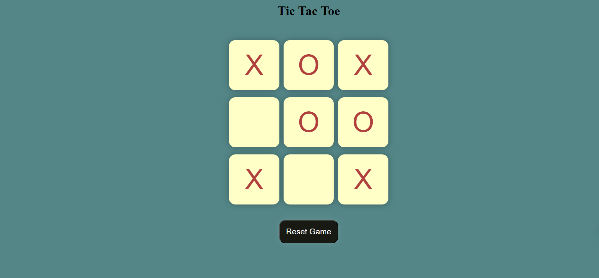

# Tic-Tac-Toe
## Dive into the project
<em>(Tap on Tic-Tac-Toe icon to view the project)</em>

## Overview:
A captivating web application developed with HTML, CSS, and JavaScript, presenting the timeless game of Tic-Tac-Toe. Players engage in strategic matches, taking turns to mark their symbols on a grid. The user-friendly interface enables seamless gameplay, providing an immersive experience for players of all skill levels.

## Features:
- **Two-Player Mode:** Challenge a friend and take turns on the same device.
- **Interactive Interface:** Click on the grid cells to place your X or O.
- **Visual Feedback:** Real-time updates and animations for each move.
- **Responsive Design:** Ensures compatibility across various devices and screen sizes.

## Technologies Used:
- **HTML:** Used for structuring the Tic-Tac-Toe interface and elements.
- **CSS:** Used for styling the visual presentation of the grid and overall layout.
- **JavaScript:** Used for implementing the interactive functionality of the game, including event handling and game logic.
  <pre>
    </pre>

## Usage:
1. **Two-Player Mode:**
   - Select the two-player option to play against a friend on the same device.
2. **Gameplay:**
   - Click on an empty grid cell to place your symbol (X or O).
   - Alternate turns and aim to get three of your symbols in a row horizontally, vertically, or diagonally.

## Learnings:
Through the Tic-Tac-Toe project, I gained valuable insights into various aspects of web development:
- **HTML Structure:** Designing the Tic-Tac-Toe grid using HTML taught me about structuring elements and creating interactive components.
- **CSS Styling:** Applying CSS styles to the grid and layout allowed me to enhance the visual presentation and user experience.
- **JavaScript Event Handling:** Implementing click interactions in JavaScript helped me understand event handling and DOM manipulation.
- **Game Logic:** Developing the game logic for checking win conditions and alternating turns improved my problem-solving skills.

## Contribution:
Contributions to the project are welcome! Feel free to fork the repository, make improvements, and submit pull requests to suggest new features or enhancements.

## License:
This project is open-source under the [MIT License](LICENSE), allowing for collaboration and distribution.
